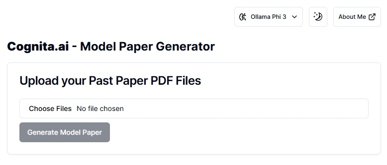

# Cognita.ai 🧠📄

Cognita.ai is a web application that generates model question papers from your past exam PDFs using advanced AI models. Upload your PDF files, select your preferred AI model (Ollama Phi 3 or MiniCPM H.F.), and instantly receive a new, high-quality model paper tailored to your content. The app features a modern, responsive UI built with Next.js, React, and TailwindCSS.

## ✨ Features

- **AI-Powered Question Generation:** Utilizes state-of-the-art language models to analyze your uploaded PDFs and generate relevant exam questions.
- **Multiple Model Support:** Choose between Ollama Phi 3 and MiniCPM H.F. for question generation.
- **User-Friendly Interface:** Simple drag-and-drop PDF upload, progress tracking, and instant download of generated papers.
- **PDF Processing:** Extracts and preprocesses text from your PDFs for optimal question generation.
- **Customizable Output:** Ensures topic coverage and question diversity in the generated model paper.

## 🚀 Getting Started

1. Clone the repository.
2. Install dependencies: `npm install`
3. Start the development server: `npm run dev`
4. Open [http://localhost:3000](http://localhost:3000) in your browser.

## 🛠️ Tech Stack

- Next.js 14
- React 18
- TailwindCSS
- Python (for backend PDF and NLP processing)
- HuggingFace Transformers (for local model inference)
- NLTK, spaCy, Gensim (for NLP tasks)

## 🤝 Contributing

Pull requests and issues are welcome! Please see the [Next.js documentation](https://nextjs.org/docs) for more info on the framework.

---

**Note:**  
- This project is for educational and research purposes.  
- For any issues or feature requests, please open an issue or contact the maintainer.

---

👨‍💻 **About the Creator**
Hi! I'm Geethika Isuru, an AI Engineer & Entrepreneur who's trying to make a better world with AI.

💼 [LinkedIn Profile](https://www.linkedin.com/in/geethikaisuru/)

📂 [GitHub Profile](https://github.com/geethikaisuru)

🛜 [Website](https://geethikaisuru.me/)
